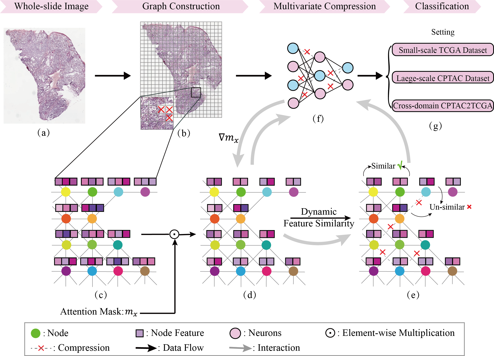

# MCCM-main

PyTorch implementation of "MCCM: A Multivariate Combination Compression Method for GNN-based Histopathological Image Diagnosis".

  

## Setup
The following dependencies are recommended for the installation of the environment.

- python 3.8.18
- torch 2.1.2
- torch_geometric 2.5.3

## Dataset
It is recommended to download the following datasets from the official website:

- CPTAC-LUAD: https://www.cancerimagingarchive.net/collection/cptac-luad/
- CPTAC-LSCC: https://www.cancerimagingarchive.net/collection/cptac-lscc/
- TCGA-LUAD: https://portal.gdc.cancer.gov/
- TCGA-LUSC: https://portal.gdc.cancer.gov/

## Training and Testing
For training and testing, use the following script:

- `main.py`
